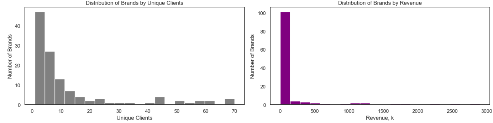

# Audio Sales Analysis

###   
*Click above to view the complete data analysis with visualizations and insight*

### 🎯 Objective:
* This project involves analyzing data for a wholesale audio equipment company offering a wide range of products, including professional audio systems, home theaters, portable audio devices, and accessories.
* The company collaborates with large retail chains and specialized stores. Customers submit purchase requests through a CRM system, after which sales managers contact them to finalize orders, which are either confirmed or canceled.
* The objective of the project is to analyze sales and customer data to extract actionable insights and support business decision-making.

### 📊 Dataset:
**Key variables:** order_id, product_id, quantity, date, client_id, status (confirmed/canceled), price(in USD), category

**Aggregated DataFrame for Analysis:**  
  

### 🛠️ Technologies Used:
Libraries: pandas, seaborn, matplotlib  

### 📁 Repository Structure:
1. audio-sales-analysis.ipynb - working file  
2. df_orders.csv - datasets - order data  
4. df_order_status.csv - dataset - order status and client data  
5. df_products.csv - dataset - product data    

### 🔍 Analysis Process:  
* Conducted preliminary analysis (EDA) and data preprocessing  
* Orders by Dates Analysis  
* Confirmed vs Canceled Orders Analysis  
* Unusual Data Analysis  
* Revenue & AOV by dates Analysis  
* Products analysis  
* Clients analysis

### 💡 Key Findings:
* March 2024 data highlights a volatile yet concentrated audio equipment market. Confirmed orders consistently outnumber cancellations, with peak activity on March 13–14 driven partly by CRM-related reorders. Daily revenue closely follows order volume, while average order value varies, reflecting diverse customer and order types.
* Wired audio equipment dominates product sales, led by headphones, followed by karaoke systems, headsets, and speakers. Brand analysis shows a long-tail distribution: a few major players: JBL, Heco, Klipsch, Yamaha, KEF - they showed high revenue and more unique clients. But the majority of brands remained in low revenue - client zone.
* Customer segmentation identifies Heavy, Medium, and Small Buyers, with larger orders driving the majority of revenue. Overall, the market combines high volatility, concentrated brand leadership, and clear segmentation across products and customer behavior.
* The following business recommendations may be given:
  * Improve CRM reliability to prevent cancellations and reduce forced reorders.
  * Prioritize inventory and marketing for high-demand wired audio products and leading brands.
  * Focus on premium and high-volume clients to maximize revenue per transaction.
  * Monitor smaller brands and niche segments for growth opportunities without overextending resources.
  * Track AOV fluctuations to understand customer behavior and optimize pricing strategies.

### 📈 Visualizations: 
  

  

  

  

  

  

  

### 📌 Project Notes:
***This is an educational project for learning data analysis and visualization techniques.***
